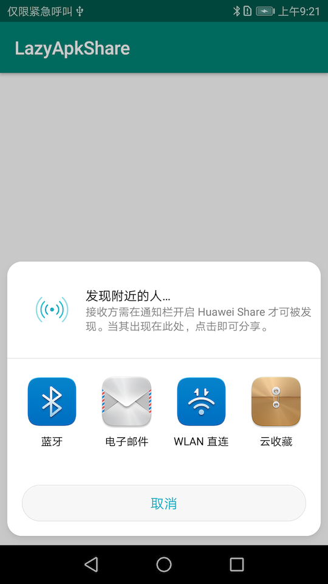

[](https://jitpack.io/#onlyloveyd/LazyApkShare)
# LazyApkShare
A Simple Realization of Current Application Sharing Function.

## Installation
### Gradle
**Step 1.** Add it in your root build.gradle at the end of repositories:
```groovy
allprojects {
    repositories {
	      maven { url 'https://jitpack.io' }
    }
}
``` 
**Step 2.** Add the dependency
```groovy

dependencies {
    implementation 'com.github.onlyloveyd:LazyApkShare:1.1'
}
```

## Basic Usage
> You should deal with Runtime Permission by youself. See more details in Sample.

```java
 shareManager = new ShareManager(this);
 shareManager.shareApp(getPackageName());
```

## Basic Result


## Support
[Thanks for support](http://www.onlyloveyd.cn/about)
